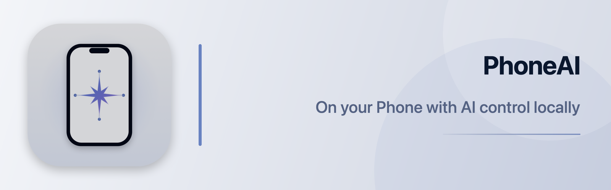
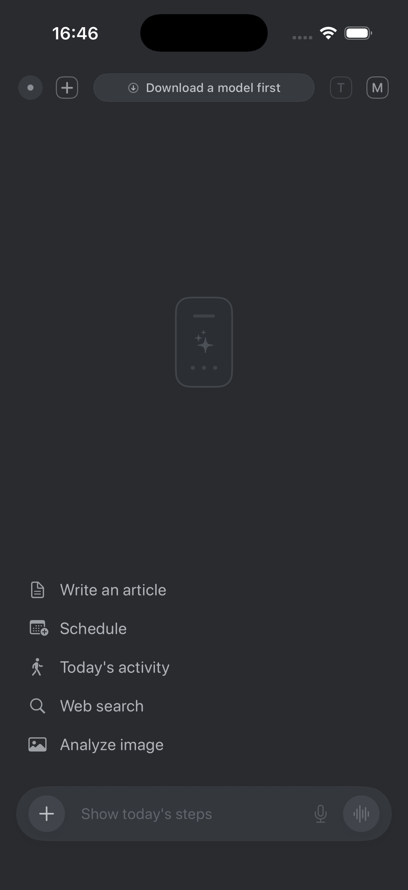

<p align="center">
  
</p>

# PhoneAI

PhoneAI is a local AI assistant application for iPhone. This README records ongoing project updates, fixes, release changes, and important development notes.

## TestFlight

PhoneAI is now available on TestFlight: **[Join the PhoneAI beta](https://testflight.apple.com/join/83pVSbzt)**.

## App UI

<p align="center">
  
</p>

## Changes on August 28, 2026

### Apple Liquid Glass adaptation

- Added iOS 26 Liquid Glass styling specifically to interactive icon controls.
- Kept toolbars, the composer, attachment tray, quick actions, prompts, and settings surfaces in the existing deep-gray visual system.
- Added backward-compatible icon fills and outlines for devices running earlier operating-system versions.
- Updated the application version to `1.5.2`.
- Updated the build number to `49`.
- Synchronized version and build metadata between the main app and Live Activity widget.

### Concurrent reply isolation

- Fixed delayed answers overwriting a newer answer when multiple requests complete out of order.
- Bound streaming updates and completion callbacks to each assistant message's immutable UUID instead of a mutable array index.
- Extended UUID-based reply ownership across standard generation, multimodal replies, image follow-ups, planner completion, tool fallback, and prior-context answers.
- Made the chat renderer create a separate response block for each independent assistant message rather than merging consecutive answers.
- Preserved every completed answer in the conversation when an earlier request finishes after a later request.
- Added regression contracts covering message ownership and independent response rendering.

## Changes on August 27, 2026

### Complete PhoneAI migration

- Renamed the application from PhoneClaw to PhoneAI across the app target, Live Activity widget, Xcode project, workspace, shared scheme, Swift packages, tests, files, folders, products, documentation, website, and CI workflows.
- Renamed the main application product to `PhoneAI.app` and the extension to `PhoneAILiveActivityWidget.appex`.
- Updated the application bundle identifier to `com.yokotox.phoneai`.
- Updated the widget bundle identifier to `com.yokotox.phoneai.LiveActivityWidget`.
- Renamed the URL scheme, Bonjour service, background identifiers, persistence identifiers, package modules, and test modules.
- Updated public repository and GitHub Pages links to:
  - <https://github.com/tangzhiyin/PhoneAI>
  - <https://tangzhiyin.github.io/PhoneAI/>
- Preserved the previous remote repository as a legacy Git remote while making `tangzhiyin/PhoneAI` the primary origin.

### Private local Skill handling

- Removed `Skills/Library/crisp/` from the public Git repository.
- Added the private local Skill directory to `.gitignore`.
- Preserved the three Skill files in the local working copy.
- Explicitly removed the private Skill directory from every built app bundle so it cannot be distributed through TestFlight.
- Removed the public contract test that required those private files in a fresh clone.
- Confirmed that the GitHub repository contains no files under the private Skill path.

### Context-length reliability

- Fixed false “context too long” failures that could interrupt normal user questions.
- Added progressive removal and summarization of old conversation history and completed tool evidence.
- Added a compact system-prompt recovery mode when the normal prompt exceeds the safe context budget.
- Added oversized-input compaction that preserves the beginning and latest details of the user request while shortening the middle.
- Added a direct-answer fallback when a tool schema is too large, instead of terminating the conversation.
- Retained a final safety rejection only for requests that still cannot fit after every recovery stage.
- Added token-budget and source-contract test coverage for the recovery behavior.

### Bundled default AI model

- Added Release and TestFlight archive support for bundling Gemma 4 E2B directly inside `PhoneAI.app`.
- Made the bundled model the immediately available default model on a fresh installation, without requiring a separate in-app download.
- Added an exact 2,588,147,712-byte integrity check before packaging the model.
- Made Archive fail with a clear error when the local E2B file is missing, preventing an accidental TestFlight upload without the default model.
- Kept Debug builds lightweight and preserved the existing in-app downloader as the fallback for source builds without the local model.
- Kept the 2.59 GB model binary out of GitHub; release builders place `gemma-4-E2B-it.litertlm` in the ignored `Models/` directory before archiving.

### Simulator model-loading diagnosis

- Diagnosed downloaded Gemma 4 E2B load failures as an iOS Simulator runtime limitation rather than a damaged model file.
- Confirmed the complete 2,588,147,712-byte model passes LiteRT container parsing before the Simulator Metal shader compiler fails.
- Added an immediate, localized explanation that LiteRT local inference requires a physical iPhone.
- Classified this failure as an unavailable backend so the interface shows the actual cause instead of a generic model-load error.

### Xcode package-resolution repair

- Fixed simultaneous missing-module errors for MLX, WhisperKit, Numerics, Tokenizers, and MarkdownUI caused by corrupted PhoneAI DerivedData.
- Replaced only the stale PhoneAI build cache and regenerated the Swift Package dependency graph.
- Restored successful signed Simulator builds in Xcode's normal DerivedData location.
- Removed the final two Xcode build-phase issues by making the Gemma bundling and private-Skill removal scripts dependency-aware.
- Added tracked placeholder metadata for the ignored `Models/` directory so incremental builds can detect local model additions without publishing model weights.
- Recovered a stuck Xcode PIF transfer session that caused both Clean and Build to fail before target compilation.
- Restarted the PhoneAI build service session and confirmed a complete Clean followed by a signed Simulator Build.

### Deep-gray visual refresh

- Replaced the previous light porcelain and copper palette with a unified deep-gray color system.
- Updated the main chat screen, settings, Skill manager, text, borders, buttons, cards, and chat bubbles to use the new palette.
- Replaced the empty-chat center mark with a small, low-contrast iPhone outline containing AI sparkle and node elements.
- Reduced the brightness, saturation, and contrast of both default and dark App Icons.
- Preserved both App Icons as 1024×1024 RGB PNG files without alpha channels.
- Added a current Simulator screenshot of the deep-gray chat interface to this README.

### Release metadata

- Published PhoneAI to TestFlight with a public invitation link: <https://testflight.apple.com/join/83pVSbzt>.
- Updated the application version to `1.5.0`.
- Updated the build number to `47`.
- Synchronized the version and build number between the main app and Live Activity widget.
- Removed the embedded-extension version mismatch warning that could affect archive validation.

## Changes on August 26, 2026

### Build and compatibility repairs

- Updated obsolete Xcode 26 and Foundation Models APIs.
- Removed an unsupported preview-only language-model executor.
- Refactored a LiteRT multimodal closure that exceeded Swift compiler type-checking limits.
- Removed a missing OpenJTalk resource reference and restored CocoaPods integration.
- Corrected stale LIVE and LiveLand tests.
- Isolated device and Simulator ASR/TTS implementations with conditional compilation.
- Restricted Piper Plus headers and libraries to supported device SDK builds.
- Corrected Simulator builds for frameworks without Simulator slices.
- Removed stale SwiftPM module caches that referenced the previous absolute repository path.
- Repaired Yams module-map failures by restoring the CocoaPods workspace configuration.
- Updated MLX Metal shader settings to remove known C++ language warnings.
- Made custom runtime-copy and re-sign build phases dependency-aware.
- Ensured optional LiteRT components are skipped cleanly when a compatible platform slice is unavailable.

### Web Search reliability

- Changed Web Search providers from sequential execution to concurrent execution.
- Added strict request and resource timeouts to prevent searches from hanging indefinitely.
- Disabled waiting for unavailable network connectivity.
- Limited automatic query variants to keep search latency bounded.
- Added provider coverage for mainland China and international networks.
- Added Bing, Bing News, DuckDuckGo, Google News, and Baidu News sources.
- Added RSS and challenge-page validation so blocked provider pages become explicit failures instead of empty results.
- Added contract coverage for concurrency, timeouts, regional providers, freshness handling, and grounded-answer structure.

### Application identity and icon work

- Replaced remaining Kellyvv identity references with Crisp.
- Added a simplified iPhone and AI App Icon with separate default and dark appearances.
- Removed all remaining PhoneClaw path and content variants during the PhoneAI migration preparation.

### GitHub and CI

- Added and repaired GitHub Actions workflows for iOS builds and GitHub Pages.
- Configured CI to use Xcode 26.4.1 and the iOS 26 SDK.
- Updated the Pages deployment base path for the PhoneAI repository.
- Rebased local work onto the latest remote history without force-pushing.
- Audited the publishable tree for credentials, generated artifacts, old identity paths, and private Skill files.

## Current project configuration

| Item | Value |
|---|---|
| Application | PhoneAI |
| Version | 1.5.0 |
| Build | 47 |
| Main bundle ID | `com.yokotox.phoneai` |
| Widget bundle ID | `com.yokotox.phoneai.LiveActivityWidget` |
| Xcode workspace | `PhoneAI.xcworkspace` |
| Shared scheme | `PhoneAI` |
| Minimum iOS version | iOS 17 |
| Primary repository | <https://github.com/tangzhiyin/PhoneAI> |

## Build from source

```bash
git clone https://github.com/tangzhiyin/PhoneAI.git
cd PhoneAI
pod install
open PhoneAI.xcworkspace
```

Always open `PhoneAI.xcworkspace`, not `PhoneAI.xcodeproj`, because the application uses CocoaPods dependencies.

In Xcode:

1. Select the `PhoneAI` target.
2. Open **Signing & Capabilities**.
3. Select the correct Apple Developer team.
4. Confirm that automatic signing is enabled.
5. Select an iPhone, Simulator, or generic iOS device.
6. Build or archive the application.

To create a TestFlight archive with Gemma 4 E2B preinstalled, place the complete model at:

```text
Models/gemma-4-E2B-it.litertlm
```

The model must be exactly 2,588,147,712 bytes. It is intentionally ignored by Git because GitHub cannot host a binary of this size. Normal Debug builds do not copy the model; Release archives bundle it into the app automatically.

## Validation completed

- Debug iOS device build: passed.
- Debug iOS Simulator build: passed.
- Release iOS device build: passed.
- Unsigned archive: passed.
- Native Xcode workspace build: passed without errors or warnings.
- PhoneAI Core tests: 113 passed.
- PhoneAI Gateway tests: 3 passed.
- App Icon validation: both icons are 1024×1024 RGB PNG files without alpha.

## Repository privacy note

The private local Skill files under `Skills/Library/crisp/` are intentionally excluded from Git, the public GitHub repository, and built application bundles.
