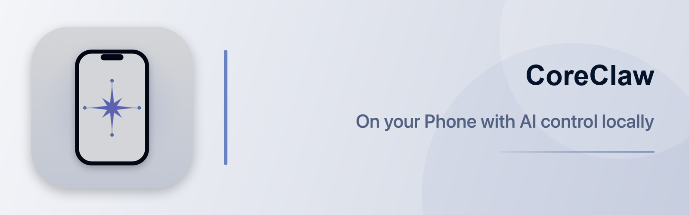
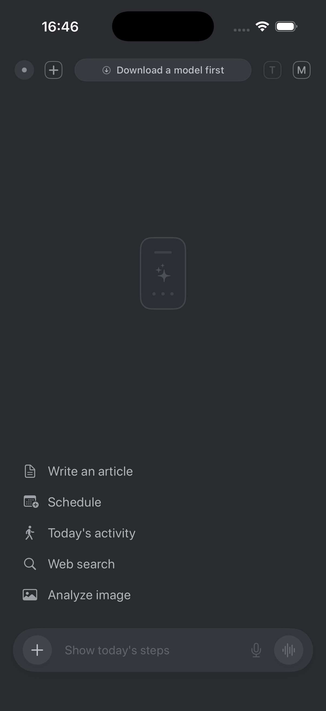

<p align="center">
  
</p>

# CoreClaw

[English](README.md) | [简体中文](README.zh-CN.md)

CoreClaw is a local-first AI assistant application for iPhone and iPad. This README records ongoing project updates, fixes, release changes, and important development notes.

## Changes on October 6, 2026

### Foreground-only voice and build 63

- Updated the main app and Live Activity widget to version `1.7.0` with build number `63`, preserving their existing bundle identifiers and persistent user data.
- Removed the `audio` background mode, the LiveLand continued-processing task registration, and the background GPU entitlement.
- Kept voice input, LIVE conversations, LiveLand, camera assistance, and audio playback available in the foreground.
- Going to the Home Screen, switching to another app, or locking the device now stops microphone capture, voice playback, and the active voice session. Returning does not automatically resume listening; start a new session to use voice again.
- Stops audio immediately before awaiting inference teardown and prevents pending permission requests, model loading, or interruption recovery from restarting an ended session.
- Temporary inactive states, such as system permission dialogs, do not by themselves end the voice session.
- Preserved background model downloads and widget/Shortcut entry points that open the app.
- Updated English, Simplified Chinese, and Japanese microphone descriptions, plus the in-app and local website information, to explain foreground-only voice behavior.

### Current permission and privacy information

- Permission entry screens use **Continue** before the system dialog; users choose whether to authorize access, and unrelated features remain available if they decline.
- Contacts, Camera, and Location purpose strings explain the requested information and provide concrete examples in all three supported languages.
- The in-app and local website privacy policies explain HealthKit, local storage, web and image-derived search queries, address lookup, optional remote models, retention, and deletion.
- Local-first does not mean entirely offline: model downloads, web search, address lookup, and optional remote inference use network services.

These entries describe the local development build. Publishing this README does not publish the application, upload a TestFlight/App Store build, or deploy the locally edited website pages.

## Changes on September 8, 2026

### Release 1.7.0 and runtime resource improvements

- Updated the main app and Live Activity widget to version `1.7.0` with build number `61`, retaining bundle identifiers and persistent user data.
- Enforced web response byte limits while receiving data, including chunked responses, instead of downloading an unlimited body before clipping it.
- Cancels individual network requests promptly without tearing down other requests in the shared session; oversized pages and failed HTTP responses produce explicit errors.
- Moved periodic chat serialization and atomic disk writes off the main thread, coalescing queued saves to the latest snapshot per conversation.
- Kept ordered flush barriers for explicit saves, history reads, and deletion so older queued snapshots cannot overwrite newer data or restore a deleted chat.
- Isolated each location lookup's manager and timeout, preserved all concurrent permission waiters, and stopped location work on completion or cancellation.
- Bounded address lookup to five seconds and reports address failures explicitly while retaining valid coordinates.
- Stops and joins the MLX token producer when streaming is cancelled, discards interrupted or memory/thermal-limited KV state only after the producer stops, and explains thermal stops in the answer.

### iPhone 15 web-search scrolling

- Defers chat presentation changes during dragging and inertial scrolling, then displays the latest complete snapshot once scrolling stops.
- Keeps generation, tool results, and message persistence active; answers completed while scrolling are not lost.
- Uses lightweight plain text during streaming and restores Markdown and clickable sources afterward, including when the final text is unchanged.
- Avoids mutating label layout from size measurement and cancels pending keyboard auto-scroll when the user starts scrolling.
- Resets deferred presentation on gesture cancellation, screen exit, app lifecycle changes, and conversation switches.

## Changes on September 3, 2026

### Location-aware chat repair

- Connected the existing explicit Location permission to a real `location-current` chat tool.
- Added current coordinates, accuracy, timestamp, and Apple reverse-geocoded place details.
- Added a Location Skill for explicit current-location and nearby requests without reading location for unrelated conversations.
- Added bounded location requests with cancellation, a 12-second timeout, and clear denied, restricted, and unavailable results.

### Web-search resource optimization

- Reused one bounded ephemeral network session instead of repeatedly creating sessions for every provider and page.
- Limited per-host connections, response processing size, and evidence-page fan-out according to device memory.
- Reduced sequential fallback attempts from six sources to the three most relevant sources.
- Added cancellation checks across query variants, page downloads, evidence extraction, and fallback fetching.

## TestFlight

CoreClaw is now available on TestFlight: **[Join the CoreClaw beta](https://testflight.apple.com/join/83pVSbzt)**.

## App UI

<p align="center">
  
</p>

## Changes on September 2, 2026

### Release 1.6.0

- Updated the main app and Live Activity widget to version `1.6.0` with build number `60`.
- Added a complete Simplified Chinese README covering all English project information and update history.

### Web-search scrolling stability and release 1.5.6

- Replaced the nested selectable text view used by link-heavy web-search answers with a lightweight link-aware label.
- Preserved clickable source links while preventing text selection and inner scrolling gestures from competing with chat scrolling.
- Avoided repeated TextKit interaction work that could freeze or crash the app and heat the device while scrolling web-search results.
- Updated the main app and Live Activity widget to version `1.5.6` with build number `53`.

### Standard iPhone runtime stability

- Added a unified runtime profile for standard iPhone 14–17 hardware based on available physical memory rather than fragile model-name checks.
- Reduced output, image preprocessing, speculative decoding, and streaming refresh pressure on 6 GB devices.
- Added thermal-aware output limits and stops MLX generation if the device reaches a critical thermal state.
- Clears long-answer rendering caches when iOS reports memory pressure, reducing the chance of freezes or jetsam termination during long chats.

### Persistent local example training

- Added **Local Example Training** under **Settings → Agent** so users can teach the local model with input and preferred-response examples.
- Kept training private and on device by injecting relevant user examples into the local inference context.
- Stored training examples separately under Application Support instead of modifying the downloaded base model.
- Preserved local training data across normal TestFlight and App Store application updates and model replacements.
- Clearly identified this as example-based in-context learning because the current LiteRT and MLX inference runtimes do not expose supported on-device weight or LoRA training APIs.

### User-requested location access

- Added Location to the app Permissions settings.
- Requests **While Using the App** location authorization through a user-initiated system dialog. The current settings entry uses **Continue** rather than the original **Request** label.
- Added localized location purpose descriptions and a Settings recovery path when access is denied.
- Preserved the existing bundle identifier so iOS keeps the user's authorization choice across normal app updates.

### Automatic web search for images

- Added automatic web augmentation for image requests.
- CoreClaw first analyzes the image locally, then searches using the user's question and local visual summary.
- The original image is not uploaded to search providers; only the generated text query is sent through the existing web-search pipeline.

## Changes on August 30, 2026

### Text sending without an installed model and release 1.5.5

- Kept the text composer and send action available when no usable model is installed.
- Preserved the submitted text as a user message and added an in-conversation reminder to download a model before continuing.
- Kept image and audio submissions blocked until a compatible model is available.
- Continued to distinguish a missing model from a model that is already installed and still loading.
- Updated the main app and Live Activity widget to version `1.5.5` with build number `52`.

## Changes on August 29, 2026

### Complete CoreClaw project rename

- Unified the application name as `CoreClaw` across source code, user-facing metadata, permission descriptions, documentation, website content, and CI configuration.
- Renamed the main app, Live Activity widget, local inference engine, Core test module, and macOS gateway targets and Swift symbols.
- Renamed the Xcode project to `CoreClaw.xcodeproj`, the workspace to `CoreClaw.xcworkspace`, and the shared app scheme to `CoreClaw`.
- Renamed the main application product to `CoreClaw.app` and the extension product to `CoreClawLiveActivityWidget.appex`.
- Regenerated CocoaPods integration for the `CoreClaw` target and updated local Swift Package module paths.
- Preserved the registered app and widget bundle identifiers so existing TestFlight and App Store installations can continue receiving in-place updates.
- Confirmed that the renamed Core and Gateway test suites pass.
- Confirmed a successful `1.5.4 (51)` Xcode Release build from the renamed workspace.

## Changes on August 28, 2026

### TestFlight feedback and release 1.5.3

- Added a **Send Feedback** item at the bottom of **Settings → General**.
- Made the feedback item open the CoreClaw TestFlight page, where beta testers can send feedback to the developer.
- Updated the application version to `1.5.3`.
- Updated the build number to `50`.
- Synchronized version and build metadata between the main app and Live Activity widget.

### Home Screen App Icon adaptation

- Adapted the CoreClaw Home Screen App Icon to Apple's system-provided Liquid Glass appearance while leaving the in-app interface unchanged.

### Concurrent reply isolation

- Fixed delayed answers overwriting a newer answer when multiple requests complete out of order.
- Bound streaming updates and completion callbacks to each assistant message's immutable UUID instead of a mutable array index.
- Extended UUID-based reply ownership across standard generation, multimodal replies, image follow-ups, planner completion, tool fallback, and prior-context answers.
- Made the chat renderer create a separate response block for each independent assistant message rather than merging consecutive answers.
- Preserved every completed answer in the conversation when an earlier request finishes after a later request.
- Added regression contracts covering message ownership and independent response rendering.

## Changes on August 27, 2026

### Complete CoreClaw migration

- Renamed the application from PhoneClaw to CoreClaw across the app target, Live Activity widget, Xcode project, workspace, shared scheme, Swift packages, tests, files, folders, products, documentation, website, and CI workflows.
- Renamed the main application product to `CoreClaw.app` and the extension to `CoreClawLiveActivityWidget.appex`.
- Updated the application bundle identifier to `com.yokotox.phoneai`.
- Updated the widget bundle identifier to `com.yokotox.phoneai.LiveActivityWidget`.
- Renamed the URL scheme, Bonjour service, background identifiers, persistence identifiers, package modules, and test modules.
- Updated public repository and GitHub Pages links to:
  - <https://github.com/tangzhiyin/CoreClaw>
  - <https://tangzhiyin.github.io/CoreClaw/>
- Preserved the previous remote repository as a legacy Git remote while making `tangzhiyin/CoreClaw` the primary origin.

### Private local Skill handling

- Removed `Skills/Library/crisp/` from the public Git repository.
- Added the private local Skill directory to `.gitignore`.
- Preserved the three Skill files in the local working copy.
- Explicitly removed the private Skill directory from every built app bundle so it cannot be distributed through TestFlight.
- Removed the public contract test that required those private files in a fresh clone.
- Confirmed that the GitHub repository contains no files under the private Skill path.

### Context-length reliability

- Fixed false “context too long” failures that could interrupt normal user questions.
- Added progressive removal and summarization of old conversation history and completed tool evidence.
- Added a compact system-prompt recovery mode when the normal prompt exceeds the safe context budget.
- Added oversized-input compaction that preserves the beginning and latest details of the user request while shortening the middle.
- Added a direct-answer fallback when a tool schema is too large, instead of terminating the conversation.
- Retained a final safety rejection only for requests that still cannot fit after every recovery stage.
- Added token-budget and source-contract test coverage for the recovery behavior.

### Bundled default AI model

- Added Release and TestFlight archive support for bundling Gemma 4 E2B directly inside `CoreClaw.app`.
- Made the bundled model the immediately available default model on a fresh installation, without requiring a separate in-app download.
- Added an exact 2,588,147,712-byte integrity check before packaging the model.
- Made Archive fail with a clear error when the local E2B file is missing, preventing an accidental TestFlight upload without the default model.
- Kept Debug builds lightweight and preserved the existing in-app downloader as the fallback for source builds without the local model.
- Kept the 2.59 GB model binary out of GitHub; release builders place `gemma-4-E2B-it.litertlm` in the ignored `Models/` directory before archiving.

### Simulator model-loading diagnosis

- Diagnosed downloaded Gemma 4 E2B load failures as an iOS Simulator runtime limitation rather than a damaged model file.
- Confirmed the complete 2,588,147,712-byte model passes LiteRT container parsing before the Simulator Metal shader compiler fails.
- Added an immediate, localized explanation that LiteRT local inference requires a physical iPhone.
- Classified this failure as an unavailable backend so the interface shows the actual cause instead of a generic model-load error.

### Xcode package-resolution repair

- Fixed simultaneous missing-module errors for MLX, WhisperKit, Numerics, Tokenizers, and MarkdownUI caused by corrupted CoreClaw DerivedData.
- Replaced only the stale CoreClaw build cache and regenerated the Swift Package dependency graph.
- Restored successful signed Simulator builds in Xcode's normal DerivedData location.
- Removed the final two Xcode build-phase issues by making the Gemma bundling and private-Skill removal scripts dependency-aware.
- Added tracked placeholder metadata for the ignored `Models/` directory so incremental builds can detect local model additions without publishing model weights.
- Recovered a stuck Xcode PIF transfer session that caused both Clean and Build to fail before target compilation.
- Restarted the CoreClaw build service session and confirmed a complete Clean followed by a signed Simulator Build.

### Deep-gray visual refresh

- Replaced the previous light porcelain and copper palette with a unified deep-gray color system.
- Updated the main chat screen, settings, Skill manager, text, borders, buttons, cards, and chat bubbles to use the new palette.
- Replaced the empty-chat center mark with a small, low-contrast iPhone outline containing AI sparkle and node elements.
- Reduced the brightness, saturation, and contrast of both default and dark App Icons.
- Preserved both App Icons as 1024×1024 RGB PNG files without alpha channels.
- Added a current Simulator screenshot of the deep-gray chat interface to this README.

### Release metadata

- Published CoreClaw to TestFlight with a public invitation link: <https://testflight.apple.com/join/83pVSbzt>.
- Updated the application version to `1.5.0`.
- Updated the build number to `47`.
- Synchronized the version and build number between the main app and Live Activity widget.
- Removed the embedded-extension version mismatch warning that could affect archive validation.

## Changes on August 26, 2026

### Build and compatibility repairs

- Updated obsolete Xcode 26 and Foundation Models APIs.
- Removed an unsupported preview-only language-model executor.
- Refactored a LiteRT multimodal closure that exceeded Swift compiler type-checking limits.
- Removed a missing OpenJTalk resource reference and restored CocoaPods integration.
- Corrected stale LIVE and LiveLand tests.
- Isolated device and Simulator ASR/TTS implementations with conditional compilation.
- Restricted Piper Plus headers and libraries to supported device SDK builds.
- Corrected Simulator builds for frameworks without Simulator slices.
- Removed stale SwiftPM module caches that referenced the previous absolute repository path.
- Repaired Yams module-map failures by restoring the CocoaPods workspace configuration.
- Updated MLX Metal shader settings to remove known C++ language warnings.
- Made custom runtime-copy and re-sign build phases dependency-aware.
- Ensured optional LiteRT components are skipped cleanly when a compatible platform slice is unavailable.

### Web Search reliability

- Changed Web Search providers from sequential execution to concurrent execution.
- Added strict request and resource timeouts to prevent searches from hanging indefinitely.
- Disabled waiting for unavailable network connectivity.
- Limited automatic query variants to keep search latency bounded.
- Added provider coverage for mainland China and international networks.
- Added Bing, Bing News, DuckDuckGo, Google News, and Baidu News sources.
- Added RSS and challenge-page validation so blocked provider pages become explicit failures instead of empty results.
- Added contract coverage for concurrency, timeouts, regional providers, freshness handling, and grounded-answer structure.

### Application identity and icon work

- Replaced remaining Kellyvv identity references with Crisp.
- Added a simplified iPhone and AI App Icon with separate default and dark appearances.
- Removed all remaining PhoneClaw path and content variants during the CoreClaw migration preparation.

### GitHub and CI

- Added and repaired GitHub Actions workflows for iOS builds and GitHub Pages.
- Configured CI to use Xcode 26.4.1 and the iOS 26 SDK.
- Updated the Pages deployment base path for the CoreClaw repository.
- Rebased local work onto the latest remote history without force-pushing.
- Audited the publishable tree for credentials, generated artifacts, old identity paths, and private Skill files.

## Current project configuration

This table describes the local development configuration, not an announcement of a published release.

| Item | Value |
|---|---|
| Application | CoreClaw |
| Version | 1.7.0 |
| Build | 63 |
| Voice operation | Foreground only; no automatic listening resume after backgrounding |
| Background model downloads | Retained |
| Main bundle ID | `com.yokotox.phoneai` |
| Widget bundle ID | `com.yokotox.phoneai.LiveActivityWidget` |
| Xcode workspace | `CoreClaw.xcworkspace` |
| Shared scheme | `CoreClaw` |
| Minimum iOS version | iOS 17 |
| Primary repository | <https://github.com/tangzhiyin/CoreClaw> |

## Build from source

```bash
git clone https://github.com/tangzhiyin/CoreClaw.git
cd CoreClaw
pod install
open CoreClaw.xcworkspace
```

Always open `CoreClaw.xcworkspace`, not `CoreClaw.xcodeproj`, because the application uses CocoaPods dependencies.

In Xcode:

1. Select the `CoreClaw` target.
2. Open **Signing & Capabilities**.
3. Select the correct Apple Developer team.
4. Confirm that automatic signing is enabled.
5. Select an iPhone, Simulator, or generic iOS device.
6. Build or archive the application.

Model weights are intentionally kept outside Release and TestFlight application bundles. The app downloads models into:

```text
Documents/models/
```

This persistent application-data directory survives normal App Store and TestFlight updates. Local development weights under the ignored repository `Models/` directory are not copied into Release archives.

## Validation completed

### October 6, 2026 — 1.7.0 (63)

- Foreground voice, permission, LIVE, and widget regressions: 29 selected tests passed.
- Debug iOS Simulator and unsigned Release iOS device builds: passed.
- Release product inspection: app and widget both report `1.7.0 (63)`; background audio and continued-processing declarations are absent, and localized microphone descriptions are packaged.
- A newly signed Archive, upload, and physical-device verification are separate steps; the checks above do not establish an App Store or TestFlight release.

### Earlier validation records

The following records refer to earlier development builds, not to a new signed `1.7.0 (63)` archive.

- Debug iOS device build: passed.
- Debug iOS Simulator build: passed.
- Release iOS device build: passed.
- Unsigned archive: passed.
- Native Xcode workspace build: passed without errors or warnings.
- CoreClaw Core tests: 113 passed.
- CoreClaw Gateway tests: 3 passed.
- App Icon validation: both icons are 1024×1024 RGB PNG files without alpha.

## Repository privacy note

The private local Skill files under `Skills/Library/crisp/` are intentionally excluded from Git, the public GitHub repository, and built application bundles.
