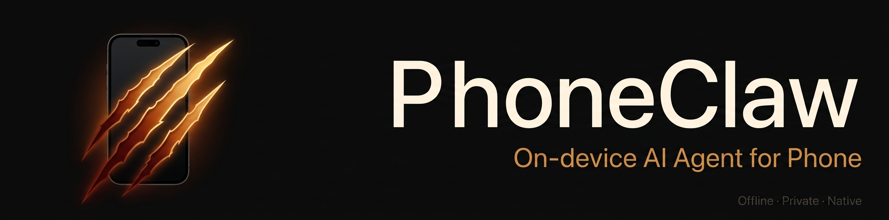

<div align="center">



把手机变成本地 AI Agent 运行时。


[官网](https://tangzhiyin.github.io/PhoneClaw_Crisp/zh/) · [TestFlight](https://testflight.apple.com/join/YuUSwq78) · [English](README.md) · [报告问题](https://github.com/tangzhiyin/PhoneClaw_Crisp/issues) · [功能建议](https://github.com/tangzhiyin/PhoneClaw_Crisp/issues)

</div>

<div align="center">

[核心能力](#核心能力) · [内置 Skill](#内置-skill-示例) · [技术文章](#技术文章) · [快速开始](#快速开始) · [Mac 远程](#7-使用-mac-客户端远程推理) · [自定义 Skill](#自定义-skill) · [常见问题](#常见问题) · [后续计划](#后续计划)

</div>

PhoneClaw 是面向手机和端侧设备的本地 AI Agent 框架。它在设备端运行 Gemma 4 E2B / E4B（LiteRT）和 MiniCPM-V 4.6，通过原生移动端 Skills 处理日历、提醒事项、通讯录、剪贴板、健康数据、图片理解、语音和 LiveLand；需要实时信息时，可以由用户显式触发联网搜索、网页读取或局域网 Mac Gateway 推理。

*本项目与 Android 自动化仓库 rohanarun/phoneclaw、GitHub 上的 phoneclaw 组织无关；Android 应用商店搜索结果中的同名 App 也是另一个产品。*

## 演示视频

<div align="center">
  <video src="https://github.com/user-attachments/assets/355bf2bf-d9cc-4354-aae0-c5d5cb0ca1ee" width="100%" height="auto" controls autoplay loop muted></video>
  <p><em>演示：PhoneClaw 在设备端通过 LiteRT 运行 Gemma 4，并执行原生 iOS Skills。</em></p>
</div>

## 最新更新

**2026-06-23**

- 新增 **LiveLand**：可以在灵动岛里使用 PhoneClaw，本地 AI 会边听边理解你的指令，并把执行结果直接显示出来
- 可以从桌面小组件、锁屏小组件、快捷指令、控制中心小组件和 App 内入口启动 LiveLand，非 iOS 27 系统也可以体验
- 任务执行过程更清楚：你能看到 PhoneClaw 已接收指令、正在理解、正在查询或执行、正在整理结果、已完成
- 支持更自然地完成手机任务：查询健康数据、创建提醒、安排日程、查找联系人、翻译内容等，不需要记固定命令
- 修复从 LiveLand 小组件进入时偶尔误提示“请先下载模型 / 模型加载中”的问题，已下载模型会正常进入
- 对不明确的时间、标题、联系人和删除/批量操作会先问清楚再执行，避免误删或创建错误内容
- LiveLand 仍然基于本地模型运行，默认不需要云端推理，也没有按次计费或 Token 限制
- TestFlight 体验链接：[https://testflight.apple.com/join/YuUSwq78](https://testflight.apple.com/join/YuUSwq78)

**2026-06-08**

- 新增 Mac 客户端 PhoneClaw Gateway：在 Mac 上常驻运行，通过 Bonjour 自动广播局域网服务，让 iPhone 端可以配对并使用 Mac 上的 Ollama、Codex CLI 或 Antigravity CLI 作为远程推理源
- iPhone 设置页新增「Mac 远程推理」入口：搜索同一局域网内的 Mac、在 Mac 端审批配对、选择 Mac 上的模型后即可回到聊天页使用
- 远程模型只在用户主动配对并选择后启用；如果 Mac 端选择 Ollama，推理留在你的 Mac 上；如果选择 CLI 或其它上游 provider，请以对应 provider 的数据处理方式为准
- 使用方法：先下载 [PhoneClawGateway-macOS-v0.1.1.zip](https://github.com/tangzhiyin/PhoneClaw_Crisp/releases/download/mac-gateway-v0.1.1/PhoneClawGateway-macOS-v0.1.1.zip)，解压打开 `PhoneClawGateway.app`，允许本地网络权限，再到 iPhone 的「Mac 远程推理」里配对；详细步骤见 [使用 Mac 客户端远程推理](#7-使用-mac-客户端远程推理)

**2026-06-05**

- PhoneClaw 已开放 TestFlight 测试：[加入 TestFlight](https://testflight.apple.com/join/YuUSwq78)
- 重构整体 Agent 框架：优化 Skill 结果语义、技能路由、工具调用链、上下文续问和多步骤任务处理，让模型更稳定地判断该直接回答、调用工具，还是延续上一轮结果，减少误触发工具、重复调用和追问跑偏
- 新增健康范围报告：支持按时间段汇总步数、距离、活动能量、心率、睡眠、运动、体重和心率变异性，并在本地生成健康摘要、趋势和关键指标说明

<details>
<summary>历史更新</summary>

### 2026-06-01

- PhoneClaw 已开放 TestFlight 测试：[加入 TestFlight](https://testflight.apple.com/join/YuUSwq78)
- 新增日历读取：可查询今天、明天、本周和未来 7 天日程，支持忙闲和空闲时间分析
- 优化联网搜索和长回复浏览：获取实时信息后可整理回答，模型输出时也能正常上下查看历史

### 2026-05-17

- PhoneClaw 已开放 TestFlight 测试：[加入 TestFlight](https://testflight.apple.com/join/YuUSwq78)
- 本地私人 Agent：运行在 iPhone 上，端侧完成推理和 Skill 调用，支持完全离线的本地路径

### 2026-05-12

- 发布 v1.4.0 — [下载地址](https://github.com/tangzhiyin/PhoneClaw_Crisp/releases/tag/v1.4.0)
- 新增 MiniCPM-V 4.6 多模态模型，支持图片问答和 LIVE 模式下的摄像头实时识别
- 修复了 LIVE 模式的多个已知问题

### 2026-05-07

- 新增 MTP 推测解码开关（实验性，Gemma 4 E4B 短回复场景可加速）。

### 2026-04-25

- 发布 v1.3.1 — [下载地址](https://github.com/tangzhiyin/PhoneClaw_Crisp/releases/tag/v1.3.1)
- 增加英文的 LIVE 模式
- 修复了一些已知的 BUG
- 发布 v1.3.0 — [下载地址](https://github.com/tangzhiyin/PhoneClaw_Crisp/releases/tag/v1.3.0)
- 增加了英文版本，可以根据系统语言自动切换。
- 下载模块做了重构，支持断点续传，后台下载，系统会根据当前网络环境自动选择速度最快的节点。

### 2026-04-23

- 发布 v1.2.2 — 新增可选择 GPU 或 CPU 进行推理的功能，在配置页自由切换后端；默认 CPU 推理，兼容 Sideloadly 签名 App 的内存上限。
- ⚠️ **Sideloadly 签名 IPA 使用建议**：受签名软件内存限制，**E4B 模型只能用 CPU 推理**（选 GPU 会报错），建议直接使用 **E2B 模型**，功能完备且更稳定。
- 💡 **有条件的用户推荐用 Xcode 自行编译安装**：Xcode 开发签不受签名软件内存限制，可以 E2B / E4B + GPU 全开，性能最佳。[下载地址](https://github.com/tangzhiyin/PhoneClaw_Crisp/releases/tag/v1.2.2)

### 2026-04-20

- 发布未签名 IPA，可通过 [Sideloadly](https://sideloadly.io/) 签名安装到 iPhone，无需 Xcode 和 Mac 开发环境。[下载地址](https://github.com/tangzhiyin/PhoneClaw_Crisp/releases/tag/v1.1.0)

### 2026-04-18

- 新增 LIVE 模式语音相关模型 APP 内下载，在配置页面直接下载就可以体验

### 2026-04-17

- 新增 **LIVE 模式**：全新的实时语音交互模式，支持自然对话，随时打断，无需等待模型说完即可插话
- LIVE 模式支持**开启摄像头**，模型可以识别和理解当前摄像头画面中的环境、物体和场景，实现"看到什么说什么"的多模态实时交互


### 2026-04-10

- 新增健康数据 Skill，支持查询今日/昨日步数、本周步数趋势、步行距离、活动卡路里、静息心率、昨晚睡眠、本周睡眠、最近运动记录，共 9 项能力，数据全部在本地读取和处理
- 优化多轮对话响应速度：引入跨轮 KV Cache 复用，连续追问同类问题时首 token 响应时间降低约 3.5 倍
- 健康数据的 9 个工具由模型根据问法自动选择，无需用户指定具体查询类型

### 2026-04-09

- 还在优化框架和基础设施的工作。大幅改善多轮 agent 的框架能力:Router 跨轮保持上下文不再丢失,小模型也能稳定完成多轮工具调用

### 2026-04-08

- 模型下载新增 ModelScope 国内镜像，国内用户无需 VPN 即可下载 Gemma 4
- 大幅重构内存管理：推理预算改为按实际可用内存动态计算，去掉了过时的 prompt 长度扣减逻辑，长 prompt 和长回答不再被错误截断；多轮工具调用的上下文衔接也更稳定

### 2026-04-07

- 新增语音功能，支持录音发送，并可对语音内容进行分析和识别
- 新增思考模式，可在聊天页右上角按需开启
- 新增历史会话记录，支持新会话、切换会话和删除会话
- 优化了内存管理与推理预算，长回答、多模态和模型切换场景更稳定

### 2026-04-06

- 默认安装方式已恢复为空壳安装，模型改为在手机端按需下载
- 配置页已支持模型下载、权限查看和中英文名称显示
- 通讯录、提醒事项、日历、设备信息与剪贴板链路已做一轮稳定性修复

</details>

## 核心能力

**本地私人 Agent**：在设备端完成推理和 Skill 调用。可用自然语言处理日历、提醒事项、通讯录、剪贴板、健康数据等本机任务。

**Mac 远程推理**：可选配对同一局域网内的 Mac，通过 PhoneClaw Gateway 使用 Mac 上的 Ollama、Codex CLI 或 Antigravity CLI 模型，让手机端保留原生体验，同时把重模型推理放到 Mac 上执行。

**图片理解与 LIVE 视觉**：拍照或从相册选图后直接提问，也可以在 LIVE 模式下开启摄像头，让模型实时理解当前画面。

**个人数据分析**：读取日程、健康数据、联系人、提醒事项等本机数据，生成摘要、忙闲分析和下一步建议。数据默认只在设备端处理。

**实时信息获取**：用户明确要求时，可联网搜索公开网页、读取网页正文，并把实时信息整理成可用回答。

**语音交互**：支持语音输入和 LIVE 实时对话，适合免打字的日常问答、记录和操作。

## 技术与体验特性

**基于文件的 Skill 系统**：每项能力对应一个 Markdown 文件（SKILL.md），新增或修改能力可通过 Skill 文件完成。Skill 描述语言通用，任何人都可以直接编写和分发。

**模型管理与断点续传**：Gemma 主模型和 LIVE 语音模型支持手机端下载、取消、继续下载和失败重试，也可以在构建时打包进 App。

**完全离线优先与清晰数据流向**：推理和本机 Skill 调用默认在设备端完成，聊天内容、图片和个人数据留在 iPhone。联网搜索、读取网页和 Mac 远程推理是用户显式触发的能力；Mac 远程推理会把本轮请求发送到你配对的 Mac，后续是否访问外部服务取决于 Mac 端所选 provider。

**移动端内存优化**：内置模型切换、System Prompt 编辑、缓存清理和历史裁剪，针对手机端本地推理的内存限制做了优化。

**中英文双语体验**：配置页可选择自动、中文或 English。切换语言会同步 UI、默认系统提示词、内置 Skill、工具结果和权限文案。

## 技术文章

- [On-device Gemma on iPhone](Docs/ON_DEVICE_GEMMA.md)
- [PhoneClaw Skill System](Docs/SKILL_SYSTEM.md)
- [iOS Memory and Context Limits](Docs/IOS_MEMORY_LIMITS.md)
- [Promotion Kit](Docs/PROMOTION_KIT.md)

## 内置 Skill 示例

**日历**：用自然语言创建日历事件，支持指定标题、时间、地点。

> "明天下午两点，在高科技园区约了个会，帮我加到日历"

> "我今天有哪些日程?"

> "帮我分析一下这周忙不忙"

**提醒事项**：创建定时提醒，到点弹出系统通知。

> "提醒我今晚八点发给老板那份文件"

**通讯录**：查询、保存、更新或删除联系人，支持姓名、手机号、公司、邮箱、备注，按手机号自动去重。

> "帮我存一下王总的电话 13812345678，字节跳动的"

> "检查下联系人张晓霞的电话多少"

**剪贴板**：读写系统剪贴板，可作为多步任务的数据中转。

> "把刚才那段文字复制到剪贴板"

**翻译**：任意语种互译，自动识别源语言。

> "把刚才那段话翻译成日语"

**健康数据**：读取 HealthKit 步数、距离、卡路里、心率、睡眠、运动记录。用户授权后在本地处理。

> "我今天走了多少步"

> "昨晚睡了多久"

> "本周步数怎么样"

> "我的静息心率是多少"

**联网搜索**：用户明确要求时搜索公开网页或读取 URL，把实时信息整理成回答。

> "联网搜索今天的 AI 新闻"

> "读取这个网页并总结: https://example.com"

## 快速开始

推荐安装方式：[TestFlight](https://testflight.apple.com/join/YuUSwq78)。安装后在「模型设置」下载模型，再按需开启 Skill 权限。

源码构建环境要求：macOS + Xcode 16，iOS 17+，CocoaPods，真机 + Apple ID

| 模型 | 适用场景 |
|------|---------|
| Gemma 4 E2B | 轻量款，聊天 / 翻译 / 单轮查询，A16 及以上 |
| Gemma 4 E4B | 完整款，多轮工具对话 + 复杂 agent 能力，建议 iPhone 15 Pro 及以上 |
| MiniCPM-V 4.6 | 多模态款，图片问答 / LIVE 摄像头实时识别，建议 A17 Pro 及以上 |

### 1. 克隆项目

```bash
git clone https://github.com/tangzhiyin/PhoneClaw_Crisp.git
cd PhoneClaw_Crisp
```

### 2. 安装依赖

```bash
pod install
```

### 3. 选择模型安装方式

**方案 A（推荐）— 空壳安装，手机端下载**

直接用 Xcode 把 App 安装到手机，打开后进入「模型设置」，在手机上直接下载 E2B 或 E4B。默认工程把 `Models/` 文件留在包外，安装包更小，安装更快。

**方案 B — 打包 E2B 进 App**

Gemma 4 现在用 LiteRT-LM 推理，模型是单个 `.litertlm` 文件（不再是 MLX 权重目录）。

1. 先在电脑下载模型文件到 `Models/`（推荐用 Hugging Face CLI）：

```bash
brew install hf
mkdir -p ./Models
hf download litert-community/gemma-4-E2B-it-litert-lm gemma-4-E2B-it.litertlm --local-dir ./Models
```

2. 在 Xcode 里把 `Models/gemma-4-E2B-it.litertlm` 拖进工程，确认它作为单个文件资源出现在 `Build Phases > Copy Bundle Resources`
3. 修改 `LLM/Models/PredefinedModels.swift` 里的 `allModels`，只保留要分发的模型

> E2B 约 2.4 GB，E4B 约 3.4 GB。国内用户可设 `HF_ENDPOINT=https://hf-mirror.com` 加速，或从 ModelScope 镜像下载同名文件。`Models/` 已列入 `.gitignore`，模型文件保留在本地。

**方案 C — 同时打包 E2B + E4B**

下载两个模型文件：

```bash
brew install hf
mkdir -p ./Models
hf download litert-community/gemma-4-E2B-it-litert-lm gemma-4-E2B-it.litertlm --local-dir ./Models
hf download litert-community/gemma-4-E4B-it-litert-lm gemma-4-E4B-it.litertlm --local-dir ./Models
```

然后把 `gemma-4-E2B-it.litertlm` 和 `gemma-4-E4B-it.litertlm` 两个文件都加入 Xcode 的 `Copy Bundle Resources`。

**LIVE 模式（语音交互）额外模型**

如果你需要使用 LIVE 模式的语音识别和语音合成，需要额外下载 ASR 和 TTS 模型：

```bash
# ASR — 中文流式语音识别 (zipformer, int8, ~160MB)
hf download csukuangfj/sherpa-onnx-streaming-zipformer-zh-int8-2025-06-30 \
  --local-dir ./Models/sherpa-asr-zh \
  --exclude "test_wavs/*" "*.md" ".gitattributes"

# TTS — 中文语音合成 (keqing, ~125MB)
hf download csukuangfj/vits-zh-hf-keqing \
  --local-dir ./Models/vits-zh-hf-keqing \
  --exclude "*.py" "*.sh" ".gitattributes"
```

下载后在 Xcode 中将 `Models/sherpa-asr-zh` 和 `Models/vits-zh-hf-keqing` 以 folder reference 方式添加到 `Copy Bundle Resources`。不下载也不影响编译和基础聊天功能，LIVE 模式会自动 fallback 到系统语音。

### 4. 打开工程

```bash
open PhoneClaw.xcworkspace
```

> 请始终打开 `.xcworkspace`，不要打开 `.xcodeproj`

### 5. 配置签名并运行

1. 选择 PhoneClaw target → Signing & Capabilities
2. 选择 Team，把 Bundle Identifier 改成你自己的唯一值
3. 连接 iPhone，按 ⌘R

> 首次安装后如系统提示信任证书：设置 → 通用 → VPN 与设备管理 → 信任

### 6. 首次使用

- 右上角拼图：Skill 管理
- 右上角滑杆：模型设置 / 系统提示词 / 权限
- 空壳安装时，先在模型设置页下载模型，再开启权限，然后试试：

```
提醒我今晚八点发文件
帮我存一下王总的电话 13812345678
把刚才那段话翻译成英文
```

### 7. 使用 Mac 客户端远程推理

Mac 客户端用于把同一局域网内的 Mac 作为 iPhone 的远程推理源。手机端仍然使用 PhoneClaw 的聊天界面和 Skill 系统，模型推理请求会发到你配对的 Mac。

**方式 A：下载 release（推荐）**

1. 下载 [PhoneClawGateway-macOS-v0.1.1.zip](https://github.com/tangzhiyin/PhoneClaw_Crisp/releases/download/mac-gateway-v0.1.1/PhoneClawGateway-macOS-v0.1.1.zip)
2. 解压后打开 `PhoneClawGateway.app`
3. 首次打开时，macOS 会询问「本地网络」权限，请选择允许
4. 如果 macOS 阻止首次启动，请在 Finder 里右键 `PhoneClawGateway.app`，选择「打开」

Gateway 默认监听 `18080` 端口，并通过 Bonjour 广播 `_phoneclaw-llm._tcp` 服务。

**方式 B：从源码构建**

```bash
cd MacGateway
bash build-app.sh
open PhoneClawGateway.app
```

从源码构建后同样需要允许 macOS 的「本地网络」权限。

**配置 Mac 端运行源**

1. 打开 `PhoneClawGateway.app`
2. 在主窗口里选择运行源：Ollama、Codex CLI 或 Antigravity CLI
3. 如果使用 Ollama，先安装并启动 Ollama，再下载一个模型，例如：

```bash
ollama pull gemma3:4b
```

4. 回到 Gateway 点扫描，确认模型出现在列表里

**在 iPhone 上配对并使用**

1. 确保 iPhone 和 Mac 在同一个局域网
2. 打开 PhoneClaw → 右上角滑杆 →「Mac 远程推理」
3. 点局域网内的 Mac，在 Mac 客户端弹窗里点「允许」
4. 配对成功后选择 Mac 上的模型，回到聊天页即可使用

远程模型会出现在模型选择器的「远程模型」分组里。若手机搜不到 Mac，优先检查：Mac 客户端是否正在运行、本地网络权限是否允许、两台设备是否在同一 Wi-Fi、系统防火墙是否允许 `PhoneClawGateway.app` 接收局域网连接。

## 自定义 Skill

新增一个 Skill 的最小成本方式，是在 `Skills/Library/<skill-id>/` 下增加一个 `SKILL.md`，或者运行时写到应用沙盒：

```
Application Support/PhoneClaw/skills/<skill-id>/SKILL.md
```

```yaml
---
name: MySkill
name-zh: 我的能力
description: 这个 Skill 的作用
version: "1.0.0"
icon: star
disabled: false
type: device          # device = 调系统 API; content = 纯 prompt 类; network = 访问公开互联网

triggers:
  - 日程安排

allowed-tools:
  - my-tool-name      # device 类必填; content 类可留空数组 []

examples:
  - query: "用户会怎么说"
    scenario: "什么场景会触发"
---

# Skill 指令

告诉模型何时调用工具、如何组织参数、何时直接回答。
```

**`type` 字段决定 Skill 的执行模式**：

- **`device`**：模型先 emit `<tool_call>` 调用真实 iOS API；典型例子有 `calendar` / `clipboard` / `contacts`
- **`content`**：模型直接根据 SKILL.md 指令处理用户输入并输出最终答案，不走任何 tool；典型例子是 `translate`
- **`network`**：模型只在用户明确要求实时信息、联网搜索或读取网页时调用网络工具；典型例子是 `web-search`

如果这个 Skill 需要真正调用系统能力，再去 `Tools/ToolRegistry.swift` + `Tools/Handlers/<Name>.swift` 注册对应工具。框架会在启动时自动校验 `allowed-tools` 与 `ToolRegistry` 是否同步，写错的 tool 名会立刻在控制台暴露。


## 常见问题

为什么安装后看不到权限弹窗？
通常是因为对应 Skill 尚未执行到系统 API。如果之前已经拒绝过一次，后续授权需要到系统设置里手动开启。

为什么切模型后加载失败？
先确认：模型文件名和 `LLM/Models/PredefinedModels.swift` 里的 `allModels` 一致；如果你走的是空壳安装，模型已经在手机端下载完成；如果你走的是内置分发，该模型确实被打进了 App 包；设备内存足够。

为什么提醒事项创建失败？
最新代码会先尝试复用现有提醒列表；如果系统里没有可写列表，会再尝试自动创建一个 PhoneClaw 提醒列表。如果这一步仍失败，通常是系统提醒源本身不可写。

为什么 iPhone 搜不到 Mac 客户端？
先确认 `PhoneClawGateway.app` 正在运行，并且 macOS 已允许本地网络权限；iPhone 和 Mac 需要在同一个局域网。若仍搜不到，检查 macOS 防火墙是否允许该 App 接收连接，或者重新运行 `bash MacGateway/build-app.sh` 后再打开生成的 App。

## 后续计划

PhoneClaw 接下来的方向，是把它逐步做成一个真正可用的手机端本地 Agent 框架。

### 1. 扩展更多 iOS 原生 API

- [ ] 文件与目录操作
- [x] 图片选择、描述与问答
- [ ] 照片库读取、整理与检索
- [ ] 备忘录 / Notes
- [x] 提醒事项到期提醒
- [ ] 通用本地通知
- [ ] 地图 / 位置相关能力
- [x] URL 网页读取与内容传递
- [ ] Safari / URL Scheme 打开外部 App
- [x] 通讯录查询、创建、更新与删除
- [x] 日历创建、日程读取、忙闲和空闲时间分析
- [x] 提醒事项创建
- [x] HealthKit 健康数据只读分析

### 2. 扩展更多 Skill

后续会继续把能力拆成更清晰的 Skill，让模型、工具和权限边界各自承担明确职责。适合继续追加的方向：

- [ ] 文件管理
- [x] 图片理解
- [ ] 照片整理
- [x] 日程创建、查询与忙闲分析
- [x] 个人信息管理：通讯录、日历、提醒事项、剪贴板、健康数据
- [ ] 本地知识库检索
- [x] 语音输入 / 语音播报
- [x] 联网搜索 / 网页读取
- [x] 翻译

### 3. 串联更多本地模型

除了主聊天模型之外，后续适合接入的本地模型：

- [x] 视觉 / 多模态模型
- [ ] OCR 模型
- [x] 语音识别模型
- [x] 语音合成模型
- [ ] Embedding / Reranker 模型
- [ ] 更小的工具参数提取模型
- [ ] 更强的规划模型或多模型协作链路

这会让 PhoneClaw 从"一个大模型做所有事"，逐渐演进成"多个本地模型协同工作"的架构。

### 4. 跨 App 自动化

PhoneClaw 优先走 iOS 真正允许的跨 App 能力：

- [x] App Intents / Shortcuts（已支持 LiveLand/LIVE 启动意图，任务级意图规划中）
- [ ] URL Scheme / Deep Link
- [ ] Share Sheet / 分享扩展
- [x] 剪贴板中转
- [x] 系统提醒通知
- [ ] 系统通知唤起与跨 App 调度

更现实的目标是：在 App 之间传递内容、拉起指定 App 到指定页面、把多步操作压缩成一条自然语言命令。

### 5. 外部硬件与视觉扩展

- [x] LIVE 摄像头实时识别
- [ ] 外部视频输入
- [ ] 屏幕画面理解
- [ ] 外部硬件联动

探索把外部视频输入、屏幕画面理解和本地模型串起来，让 PhoneClaw 不只是"在手机里回答问题"，而是逐步具备更强的现实世界感知与调度能力。


## 参考链接

- [Hugging Face CLI 文档](https://huggingface.co/docs/huggingface_hub/guides/cli)
- [Hugging Face 下载文档](https://huggingface.co/docs/huggingface_hub/en/guides/download)
- [Gemma 4 E2B LiteRT 模型](https://huggingface.co/litert-community/gemma-4-E2B-it-litert-lm)
- [Gemma 4 E4B LiteRT 模型](https://huggingface.co/litert-community/gemma-4-E4B-it-litert-lm)
- [Gemma 4 E2B (ModelScope 国内镜像)](https://modelscope.cn/models/litert-community/gemma-4-E2B-it-litert-lm)
- [Gemma 4 E4B (ModelScope 国内镜像)](https://modelscope.cn/models/litert-community/gemma-4-E4B-it-litert-lm)
- [MiniCPM-V 4.6 模型](https://huggingface.co/openbmb/MiniCPM-V-4_6)
- [OpenBMB MiniCPM-V iOS Demo](https://github.com/OpenBMB/MiniCPM-V-Apps)

## License

Apache 2.0
